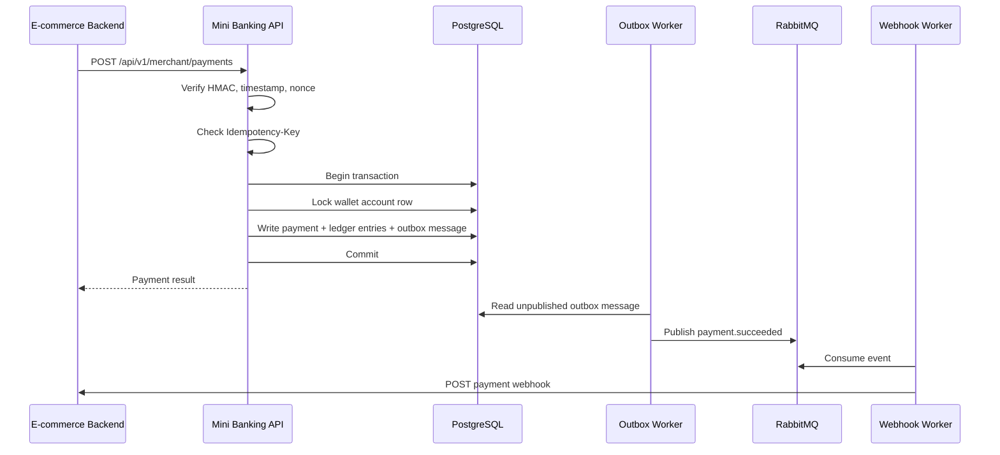

# Mini Banking Ledger & Payment Gateway

A .NET 8 backend portfolio project that models a small banking wallet and payment gateway for an E-commerce system.

The goal is not to build another CRUD demo. The goal is to prove the backend skills that matter in banking, fintech, billing, marketplace and payment systems: money consistency, ledger design, idempotency, concurrency control, async reliability, security and auditability.

## Current Status

This repository is in the foundation stage.

Implemented now:

- .NET 8 ASP.NET Core Web API scaffold.
- xUnit test project scaffold.
- Design specification for the banking/payment architecture.
- Single deployable modular monolith structure.

Planned through the milestones:

- Double-entry ledger.
- Wallet account and balance projection.
- Merchant payment APIs.
- HMAC request signing.
- Idempotency keys.
- PostgreSQL row-level locking for debit operations.
- Transactional outbox.
- RabbitMQ webhook delivery and retry.
- Refund and settlement flows.
- JWT/RBAC, audit logs, Serilog and OpenTelemetry.

## Why This Project

Most backend portfolios stop at CRUD, authentication and simple order flows. Payment and banking systems have harder problems:

- A payment request can be retried after a timeout.
- Two payment requests can debit the same wallet at the same time.
- A database commit can succeed while message publishing fails.
- A webhook can fail after money has already moved.
- A request can be forged unless the merchant contract is signed.
- Money history must be auditable and reconcilable.

This project is designed around those failure modes.

## Architecture

The first version is a modular monolith, not microservices.

```text
be/
  MiniBanking.sln
  src/
    MiniBanking.Api/
      Modules/
        Accounts/
        Ledger/
        Payments/
        Merchants/
        Webhooks/
        Audit/
      SharedKernel/
      Infrastructure/
  tests/
    MiniBanking.Tests/
```

Reasons for this shape:

- One deployable keeps the project focused and easy to run.
- Folder-based modules keep business boundaries visible.
- Ledger and payment logic can be tested deeply without distributed-service noise.
- Modules can be extracted later if real boundaries justify it.

## Target Tech Stack

- Runtime: .NET 8
- API: ASP.NET Core Web API
- Database: PostgreSQL
- ORM: EF Core, with raw SQL where locking must be explicit
- Cache/infra: Redis for rate limiting and nonce replay protection
- Broker: RabbitMQ
- Async pattern: Transactional Outbox + background workers
- Security: HMAC for merchant APIs, JWT/RBAC for admin APIs
- Observability: Serilog, correlation IDs, OpenTelemetry
- Local runtime: Docker Compose

## Payment Flow



## Core Banking Concepts

### Double-entry ledger

Every money movement must produce balanced ledger entries.

Example payment:

```text
Debit:
  User wallet account          250000 VND

Credit:
  Platform clearing account    250000 VND
```

Invariant:

```text
sum(debit) = sum(credit)
```

### Idempotency

Merchant APIs require an `Idempotency-Key`.

Expected behavior:

- Same merchant, endpoint, key and request body returns the original result.
- Same key with a different request body returns a conflict.
- Duplicate payment retries do not create duplicate ledger transactions.

### Concurrency control

Debit operations use PostgreSQL transactions and row-level locks.

Example problem:

```text
Wallet balance = 300000 VND
Payment A = 250000 VND
Payment B = 250000 VND
```

Only one payment should succeed. The other must fail with insufficient funds after reading the updated balance.

### Transactional outbox

Payment state, ledger entries and the outbox event are written in the same database transaction.

This prevents the classic dual-write failure:

```text
DB commit succeeded
RabbitMQ publish failed
```

The outbox worker can safely publish the missing event later.

## Merchant API Security

Merchant requests are signed with HMAC.

Expected headers:

```http
X-Merchant-Id: ecommerce-demo
X-Api-Key: merchant-api-key
X-Timestamp: 2026-08-15T10:00:00Z
X-Nonce: unique-random-value
Idempotency-Key: order-123-payment
X-Signature: hmac-sha256-signature
```

The API key identifies the merchant. The HMAC signature proves request authenticity and body integrity.

## Planned Demo Scenarios

The final demo should prove these flows end to end:

1. Seed a user wallet with 500,000 VND.
2. Create a payment for an E-commerce order.
3. Verify wallet balance and double-entry ledger entries.
4. Retry the same payment request and confirm no duplicate debit.
5. Run concurrent payment requests against the same wallet.
6. Force webhook failure, then verify retry succeeds.
7. Create a full or partial refund.
8. Settle merchant funds from clearing to merchant settlement.
9. Inspect audit logs and trace IDs for the full flow.

## Roadmap

1. Foundation: solution, API, tests, Docker Compose, health checks.
2. Ledger and wallet core: customers, accounts, top-up, ledger invariant tests.
3. Merchant payment API: HMAC, idempotency, safe debit, payment status.
4. Refund and settlement: reverse entries, settlement batches, reconciliation queries.
5. Outbox and webhooks: RabbitMQ, retry, webhook attempts, failure state.
6. Interview hardening: concurrency tests, audit logs, OpenTelemetry, demo scripts.

## Run Locally

Prerequisites:

- .NET 8 SDK

Commands:

```bash
cd be
dotnet restore
dotnet build
dotnet test
dotnet run --project src/MiniBanking.Api
```

Design document:

- [Mini Banking Payment Gateway Design](docs/superpowers/specs/2026-08-15-mini-banking-payment-gateway-design.md)

## Notes

This is a portfolio and learning project. It models banking/payment engineering problems, but it is not a production banking system and does not implement real PCI-DSS, KYC, AML or interbank settlement.
